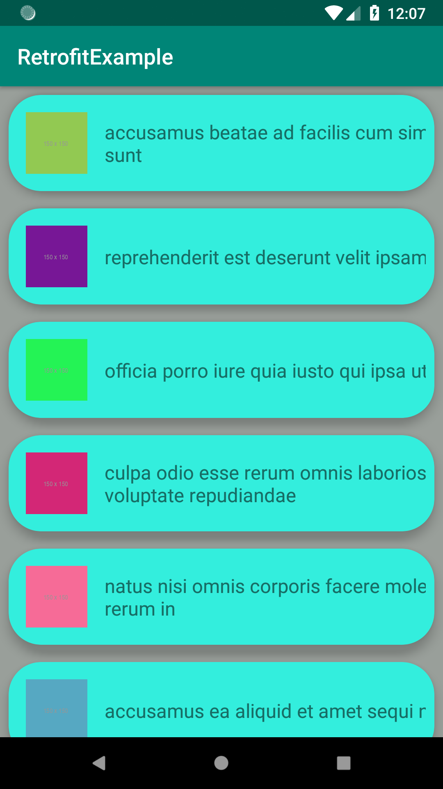

# RetrofitExample
An easy and understandable example about retrofit technology 
## Technologies Used:
<ul>
  
  <li>Retrofit</li>
  <li>GSON</li>
  <li>CardView</li>
  <li>RecyclerView</li>
  <li>Picasso</li>
</ul>

## Screenshot
  </img> 
  
 ## Rest Data:
  It's simple test data from https://jsonplaceholder.typicode.com/photos
